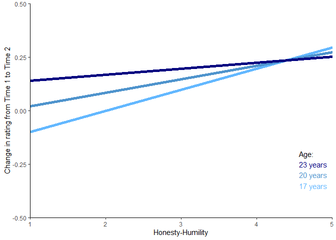
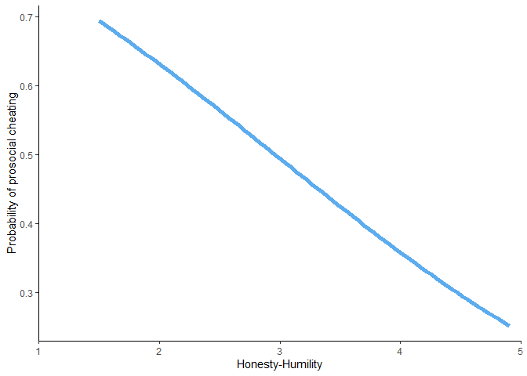
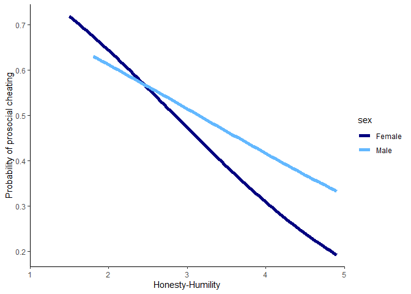
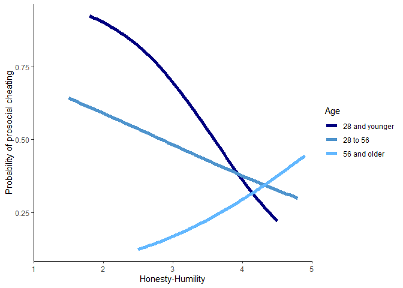

Portfolio-09
================
Ben Hardin
2023-04-20

## Intro

For this portfolio piece, I’m interested in running some moderation
analyses with various combinations of dichotomous and continuous
predictors and outcomes, and visualizing the results from those
analyses. I’m also interested in learning a little bit about the
relationship between the personality trait Honesty-Humility (HH) and
benevolent lying. HH includes trait content related to both being nice
to others and also being sincere and honest with others. Thus, it’s
interesting to know what people who are relatively high on this trait do
when telling the truth is not the nice thing to do.

Luckily, there are two studies testing this question that have their
data openly available on the internet (Thanks Paul, Ashton, & Lee (2022)
and Thielmann, Hilbig, Klein, Seidl, and Heck (2023)!) One study tested
whether HH is associated with people’s willingness to give dishonest
positive feedback on an essay. Another study tested whether HH is
associated with people’s willingness to lie about the outcome of an
economic game so that someone else (either another player or a charity)
can get money. I wanted to try to reproduce and compare the results of
these two studies, and also test the moderating effects of some
demographic variables (specifically age and gender) on the results.

### Prosocial feedback

In this study, the DV is the difference score between ratings that
participants believed they were giving privately and ratings they
believed they were giving directly to a hypothetical essay writer (the
set up for this study was nearly identical to the one described in
portfolio 8). A positive difference score is considered prosocial lying,
with the assumption being that people intentionally inflated their
feedback to be nice to the essay writer. Let’s first just predict the
difference scores just from participants’ HH scores.

``` r
library(tidyverse)
```

    ## ── Attaching packages ─────────────────────────────────────── tidyverse 1.3.2 ──
    ## ✔ ggplot2 3.4.0     ✔ purrr   0.3.5
    ## ✔ tibble  3.1.8     ✔ dplyr   1.1.0
    ## ✔ tidyr   1.2.1     ✔ stringr 1.5.0
    ## ✔ readr   2.1.3     ✔ forcats 0.5.2
    ## ── Conflicts ────────────────────────────────────────── tidyverse_conflicts() ──
    ## ✖ dplyr::filter() masks stats::filter()
    ## ✖ dplyr::lag()    masks stats::lag()

``` r
HH_feedback <- read.csv("data/HH-feedback.csv")
## data available from: https://www.sciencedirect.com/science/article/pii/S0092656622000459
```

We find a significant and positive association between HH and the
difference scores, suggesting that higher HH is associated with a
greater propensity to tell prosocial lies. The plot illustrates that
there is a weak, positive linear association between these two
variables.

``` r
HH_model <- lm(data = HH_feedback, Lying ~ HH)
summary(HH_model)
```

    ## 
    ## Call:
    ## lm(formula = Lying ~ HH, data = HH_feedback)
    ## 
    ## Residuals:
    ##     Min      1Q  Median      3Q     Max 
    ## -1.3410 -0.1895 -0.1033  0.1455  1.5728 
    ## 
    ## Coefficients:
    ##             Estimate Std. Error t value Pr(>|t|)  
    ## (Intercept) -0.13377    0.14174  -0.944    0.346  
    ## HH           0.08620    0.04173   2.066    0.040 *
    ## ---
    ## Signif. codes:  0 '***' 0.001 '**' 0.01 '*' 0.05 '.' 0.1 ' ' 1
    ## 
    ## Residual standard error: 0.3943 on 229 degrees of freedom
    ## Multiple R-squared:  0.0183, Adjusted R-squared:  0.01401 
    ## F-statistic: 4.268 on 1 and 229 DF,  p-value: 0.03996

``` r
ggplot(HH_feedback, aes(x = HH, y = Lying))+
  geom_point(position = "jitter", alpha = 0.5)+
  geom_smooth(method = "lm", se = F, color = "steelblue3", linewidth = 2)+
  theme_classic()+
  scale_x_continuous(limits = c(1, 5), expand = c(0, 0))+
  labs(y = "Change in rating from Time 1 to Time 2",
       x = "Honesty-Humility")
```

    ## `geom_smooth()` using formula = 'y ~ x'

<!-- -->

Now let’s test whether the participant’s gender may moderate the
relationship between HH and prosocial lying. Although there are a number
of possible gender identities, only a few people in the study reported a
gender other than man or woman. Thus, in order to simplify the analysis,
I excluded these people and examined gender as a binary variable.

Results did not find a significant moderating effect of gender or a
significant main effect of gender. Interestingly, the main effect of HH
has also entirely disappeared in this model.

Looking at the plot, we see there is descriptively an interaction in
which men aren’t inflating feedback very much regardless of their level
of HH, whereas women are inflating feedback more to the degree that they
are high in HH. However, we can’t be very confident in whether these
findings would generalize beyond this particular sample.

``` r
HH_feedback <- HH_feedback %>%
  filter(Gender < 3) %>%
  mutate(Gender_bin = case_when(Gender == 1 ~ "Woman", Gender == 2 ~ "Man"))

HH_moderation <- lm(data = HH_feedback, Lying ~ HH * Gender_bin)
summary(HH_moderation)
```

    ## 
    ## Call:
    ## lm(formula = Lying ~ HH * Gender_bin, data = HH_feedback)
    ## 
    ## Residuals:
    ##     Min      1Q  Median      3Q     Max 
    ## -1.3472 -0.1939 -0.1088  0.1318  1.5497 
    ## 
    ## Coefficients:
    ##                     Estimate Std. Error t value Pr(>|t|)
    ## (Intercept)         0.095924   0.270367   0.355    0.723
    ## HH                  0.004862   0.084466   0.058    0.954
    ## Gender_binWoman    -0.277362   0.320480  -0.865    0.388
    ## HH:Gender_binWoman  0.098234   0.098147   1.001    0.318
    ## 
    ## Residual standard error: 0.3961 on 224 degrees of freedom
    ## Multiple R-squared:  0.02188,    Adjusted R-squared:  0.00878 
    ## F-statistic:  1.67 on 3 and 224 DF,  p-value: 0.1743

``` r
ggplot(HH_feedback, aes(x = HH, y = Lying, group = Gender_bin))+
  geom_point(aes(color = Gender_bin, shape = Gender_bin), position = "jitter", alpha = 0.35)+
  geom_smooth(aes(color = Gender_bin), method = "lm", se = F, linewidth = 2.2)+
  scale_color_manual(values = c("steelblue2", "navy"))+
  theme_classic()+
  scale_x_continuous(limits = c(1, 5), expand = c(0, 0))+
  scale_y_continuous(limits = c(-1, 1), expand = c(0, 0))+
  labs(y = "Change in rating from Time 1 to Time 2",
       x = "Honesty-Humility",
       group = "Gender",
       color = "Gender",
       shape = "Gender")
```

    ## `geom_smooth()` using formula = 'y ~ x'

    ## Warning: Removed 8 rows containing non-finite values (`stat_smooth()`).

    ## Warning: Removed 13 rows containing missing values (`geom_point()`).

<!-- -->

Lastly, let’s test whether the relationship between HH and inflating
feedback is moderated by age. Again, we don’t find any significant main
effects or interactions.

I did want to try plotting the simple slopes for the HH x age
interaction, using a method developed by Rose Maier. One interesting
thing is that there was relatively little variability in age, because
these data were collected from a college sample (i.e., the standard
deviation for age in this study was only 3 years). This may explain why
age did not show any significant effects in this study. Descriptively,
there is an interaction in which the association between HH and lying is
greater for younger than for older participants.

``` r
age_moderation <- lm(data = HH_feedback, Lying ~ HH * age)
summary(age_moderation)
```

    ## 
    ## Call:
    ## lm(formula = Lying ~ HH * age, data = HH_feedback)
    ## 
    ## Residuals:
    ##     Min      1Q  Median      3Q     Max 
    ## -1.3716 -0.1940 -0.1058  0.1610  1.5610 
    ## 
    ## Coefficients:
    ##             Estimate Std. Error t value Pr(>|t|)
    ## (Intercept) -1.11140    1.26348  -0.880    0.380
    ## HH           0.30742    0.34124   0.901    0.369
    ## age          0.05299    0.06287   0.843    0.400
    ## HH:age      -0.01210    0.01687  -0.717    0.474
    ## 
    ## Residual standard error: 0.3959 on 201 degrees of freedom
    ##   (23 observations deleted due to missingness)
    ## Multiple R-squared:  0.01827,    Adjusted R-squared:  0.003614 
    ## F-statistic: 1.247 on 3 and 201 DF,  p-value: 0.294

``` r
## credit: https://blogs.uoregon.edu/rclub/2014/04/17/simple-slopes-in-ggplot2/

young <- mean(HH_feedback$age, na.rm = T) - sd(HH_feedback$age, na.rm = T)
avg <- mean(HH_feedback$age, na.rm = T)
old <- mean(HH_feedback$age, na.rm = T) + sd(HH_feedback$age, na.rm = T)

b0 <-  age_moderation$coeff[1]
HH <- age_moderation$coeff[2]
age <- age_moderation$coeff[3]
HHxage <- age_moderation$coeff[4]

ggplot(HH_feedback, aes(x = HH, y = Lying, group = age_cat))+
  geom_abline(color = "steelblue1", intercept = b0 + young * age, slope = HH + young * HHxage, linewidth = 2)+
  geom_abline(color = "steelblue3", intercept = b0 + avg * age, slope = HH + avg * HHxage, linewidth = 2)+
  geom_abline(color = "navy", intercept = b0 + old * age, slope = HH + old * HHxage, linewidth = 2)+
  annotate("text", label = "Age:", x = 4.66, y = -.20)+
  annotate("text", label = "23 years", x = 4.75, y = -.25, color = "navy")+
  annotate("text", label = "20 years", x = 4.75, y = -.30, color = "steelblue3")+
  annotate("text", label = "17 years", x = 4.75, y = -.35, color = "steelblue1")+
  theme_classic()+
  scale_x_continuous(limits = c(1, 5), expand = c(0, 0))+
  scale_y_continuous(limits = c(-0.5, 0.5), expand = c(0, 0))+
  labs(y = "Change in rating from Time 1 to Time 2",
       x = "Honesty-Humility")
```

<!-- -->

### Prosocial coin-flip

The DV in this study is whether participants reported “Heads” or “Tails”
after privately flipping a coin, when saying “Heads” would send \$5 to
another person or a charity. Since this is a dichotomous outcome, we’ll
run a logistic regression predicting the decision to say either “Heads”
or “Tails” from HH.

``` r
HH_coin <- read.csv("data/HH-coin.csv")

HH_coin <- HH_coin %>%
  filter(condition.cat != "pro-self")

## data available from: https://onlinelibrary.wiley.com/doi/pdfdirect/10.1111/jopy.12835
```

Results show a quite strong negative association between HH and
reporting “Heads”. In logit speak, the odds ratio = .57. The plot
illustrates this strong negative association between HH and the
probability of reporting “Heads”.

``` r
HH_logit <- glm(decision ~ hh, data = HH_coin, family = "binomial")
summary(HH_logit)
```

    ## 
    ## Call:
    ## glm(formula = decision ~ hh, family = "binomial", data = HH_coin)
    ## 
    ## Deviance Residuals: 
    ##    Min      1Q  Median      3Q     Max  
    ## -1.539  -1.052  -0.879   1.235   1.660  
    ## 
    ## Coefficients:
    ##             Estimate Std. Error z value Pr(>|z|)    
    ## (Intercept)   1.6592     0.5248   3.162 0.001569 ** 
    ## hh           -0.5607     0.1504  -3.728 0.000193 ***
    ## ---
    ## Signif. codes:  0 '***' 0.001 '**' 0.01 '*' 0.05 '.' 0.1 ' ' 1
    ## 
    ## (Dispersion parameter for binomial family taken to be 1)
    ## 
    ##     Null deviance: 674.31  on 492  degrees of freedom
    ## Residual deviance: 659.89  on 491  degrees of freedom
    ## AIC: 663.89
    ## 
    ## Number of Fisher Scoring iterations: 4

``` r
library(ggpointdensity)
```

    ## Warning: package 'ggpointdensity' was built under R version 4.2.3

``` r
ggplot(HH_coin, aes(x = hh, y = decision))+
  geom_smooth(method = "glm", se = F, method.args = list(family = binomial), linewidth = 2, color = "steelblue2")+
  theme_classic()+
  scale_x_continuous(limits = c(1, 5), expand = c(0, 0))+
  labs(y = "Probability of prosocial cheating",
       x = "Honesty-Humility")
```

    ## `geom_smooth()` using formula = 'y ~ x'

<!-- -->

Next, let’s see whether gender (or, as it was collected in this study,
sex) moderates the relationship between HH and prosocial cheating in
this study. Descriptively, it looks like females are more likely to tell
the truth than to tell a prosocial lie about the coin flip, whereas men
are about equally likely to tell the truth vs. lie.

``` r
HH_coin <- HH_coin %>%
  filter(sex == "Female" | sex == "Male")

ggplot(HH_coin, aes(x = decision, fill = sex))+
  geom_bar(color = "black", position = "dodge")+
  scale_y_continuous(limits = c(0, 161), expand = c(0, 0)) +
  theme_classic()+
  theme(axis.text.x=element_blank())+
  annotate("text", label = "Lie", x = 1, y = 158)+
  annotate("text", label = "Truth", x = 0, y = 158)+
  labs(y = "Count",
       x = "Decision")
```

<!-- -->

After running a moderated logit regression, we see there is still a
significant main of effect of HH, but no significant main effect or
moderation by sex. The plot shows a descriptive interaction, whereby the
probability of prosocial cheating is more strongly associated with HH
for females than for men.

``` r
sex_logit <- glm(decision ~ hh * sex, data = HH_coin, family = "binomial")
summary(sex_logit)
```

    ## 
    ## Call:
    ## glm(formula = decision ~ hh * sex, family = "binomial", data = HH_coin)
    ## 
    ## Deviance Residuals: 
    ##     Min       1Q   Median       3Q      Max  
    ## -1.5923  -1.0741  -0.8595   1.2079   1.8149  
    ## 
    ## Coefficients:
    ##             Estimate Std. Error z value Pr(>|z|)   
    ## (Intercept)   1.9827     0.7815   2.537  0.01118 * 
    ## hh           -0.6971     0.2226  -3.132  0.00174 **
    ## sexMale      -0.7363     1.0573  -0.696  0.48620   
    ## hh:sexMale    0.3008     0.3031   0.992  0.32104   
    ## ---
    ## Signif. codes:  0 '***' 0.001 '**' 0.01 '*' 0.05 '.' 0.1 ' ' 1
    ## 
    ## (Dispersion parameter for binomial family taken to be 1)
    ## 
    ##     Null deviance: 673.18  on 491  degrees of freedom
    ## Residual deviance: 655.63  on 488  degrees of freedom
    ## AIC: 663.63
    ## 
    ## Number of Fisher Scoring iterations: 4

``` r
ggplot(HH_coin, aes(x = hh, y = decision, group = sex))+
  geom_smooth(aes(color = sex), method = "glm", se = F, method.args = list(family = binomial), linewidth = 2)+
  scale_color_manual(values = c("navy", "steelblue1"))+
  theme_classic()+
  scale_x_continuous(limits = c(1, 5), expand = c(0, 0))+
  labs(y = "Probability of prosocial cheating",
       x = "Honesty-Humility")
```

    ## `geom_smooth()` using formula = 'y ~ x'

<!-- -->

Lastly, we’ll again try out a moderation by age. Descriptively, we can
see that there appears to be a pretty strong association such that the
probability of cheating is lower as age increases. We also have a much
wider range of ages here than we did in the previous study.

``` r
ggplot(HH_coin, aes(x = age, y = decision))+
  geom_smooth(method = "glm", se = F, method.args = list(family = binomial), linewidth = 1.5, color = "black")+
  theme_classic()+
  labs(y = "Probability of prosocial cheating",
       x = "Age")
```

    ## `geom_smooth()` using formula = 'y ~ x'

    ## Warning: Removed 1 rows containing non-finite values (`stat_smooth()`).

<!-- -->

A moderated logistic regression shows a strong main effect of HH and a
strong main effect of age, such that as these increase the probability
of prosocial cheating decreases. We also find a significant HH x age
interaction. Looking at the predicted probabilities grouped by age, we
see that the relationship between HH and the probability of cheating is
highly negative for younger adults and becomes increasingly more
positive as age increases. (This plot also looks like 3 strands of blue
spaghetti, which is pretty cool.)

``` r
age_logit <- glm(decision ~ hh * age, data = HH_coin, family = "binomial")
summary(age_logit)
```

    ## 
    ## Call:
    ## glm(formula = decision ~ hh * age, family = "binomial", data = HH_coin)
    ## 
    ## Deviance Residuals: 
    ##     Min       1Q   Median       3Q      Max  
    ## -1.6709  -1.0078  -0.8595   1.2153   1.6056  
    ## 
    ## Coefficients:
    ##             Estimate Std. Error z value Pr(>|z|)   
    ## (Intercept)  5.88367    1.86829   3.149  0.00164 **
    ## hh          -1.48493    0.52970  -2.803  0.00506 **
    ## age         -0.11594    0.04393  -2.639  0.00830 **
    ## hh:age       0.02604    0.01204   2.162  0.03059 * 
    ## ---
    ## Signif. codes:  0 '***' 0.001 '**' 0.01 '*' 0.05 '.' 0.1 ' ' 1
    ## 
    ## (Dispersion parameter for binomial family taken to be 1)
    ## 
    ##     Null deviance: 672.04  on 490  degrees of freedom
    ## Residual deviance: 643.61  on 487  degrees of freedom
    ##   (1 observation deleted due to missingness)
    ## AIC: 651.61
    ## 
    ## Number of Fisher Scoring iterations: 4

``` r
young <- mean(HH_coin$age, na.rm = T) - sd(HH_coin$age, na.rm = T)
avg <- mean(HH_coin$age, na.rm = T)
old <- mean(HH_coin$age, na.rm = T) + sd(HH_coin$age, na.rm = T)

HH_coin <- HH_coin %>%
  mutate(age_cat = case_when(age <= young ~ "28 and younger",
                             age > young & age < old ~ "28 to 56",
                             age >= old ~ "56 and older"))

ggplot(HH_coin, aes(x = hh, y = decision, group = age_cat))+
  geom_smooth(aes(color = age_cat), method = "glm", se = F, method.args = list(family = binomial), linewidth = 2)+
  scale_color_manual(values = c("navy", "steelblue3", "steelblue1"))+
  theme_classic()+
  scale_x_continuous(limits = c(1, 5), expand = c(0, 0))+
  labs(y = "Probability of prosocial cheating",
       x = "Honesty-Humility",
       color = "Age",
       group = "Age")
```

    ## `geom_smooth()` using formula = 'y ~ x'

<!-- -->
